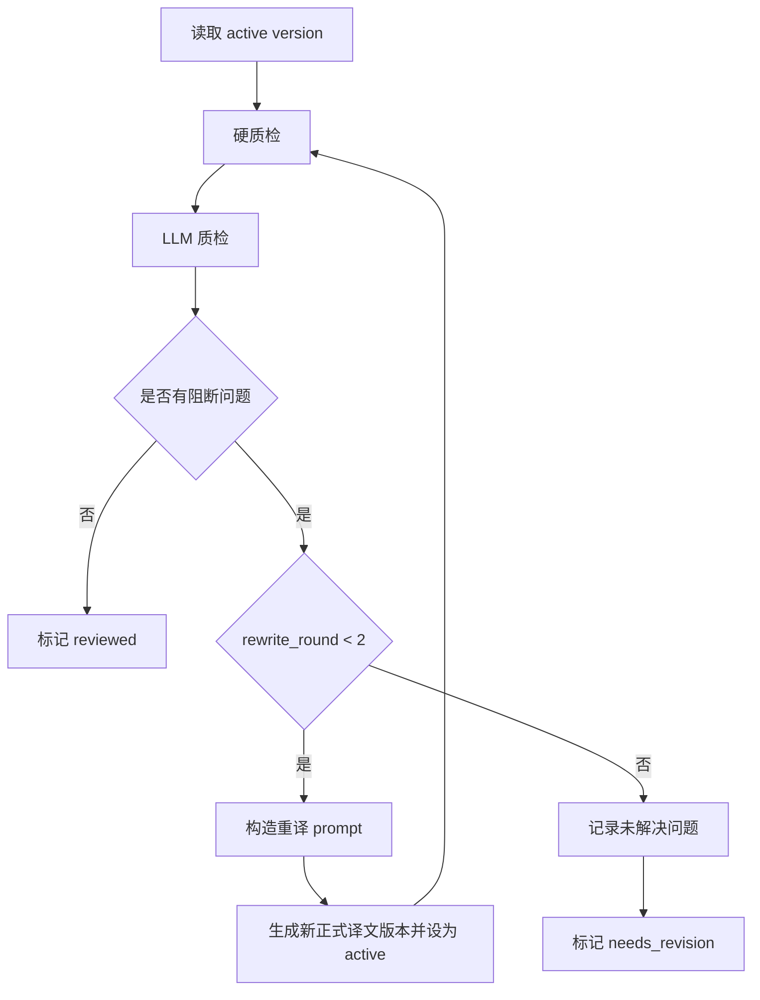

# Review 阶段 LLM 质检重译闭环设计

## 1. 背景

当前 `review` 阶段是规则质检，只检查缺失译文、空译文、原文未翻和高置信术语漏用。它适合做确定性兜底，但不能判断小说翻译里更重要的质量问题，例如漏译、误译、语气错位、人物称谓不一致、上下文承接不顺和英文可读性差。

本轮目标是把 `review` 从“只发现问题”升级为“发现问题后推动修复”的闭环：

```text
翻译初稿 -> 硬质检 -> LLM 质检 -> 问题反馈给翻译 LLM -> 重译 -> 再质检
```

用户已确认最大重译轮数为 2。

## 2. 目标

本轮实现一个混合审校闭环：

- `review` 阶段先运行现有硬质检。
- 对有可用 active translation version 的分片运行 LLM 质检。
- 如果硬质检或 LLM 质检发现阻断问题，则把问题作为下一轮重译输入。
- 每个分片最多重译 2 轮。
- 每次重译生成新的 `SegmentTranslationVersion`，并切为 active version，不覆盖历史版本。
- `ReviewRun.summary` 记录轮次、耗时、token、模型、重译次数、通过数和未解决问题数。
- `inspect.review` 能看到 LLM 质检问题、重译链路和最终状态。

## 3. 非目标

本轮不做以下事情：

- 不新增独立 stage，例如 `quality_loop`。
- 不把 `translation_multi_llm_v1` 改造成默认翻译链路。
- 不自动合并整章上下文后做整章重译。
- 不无限循环重译。
- 不让 LLM 直接修改 glossary 正式词条。
- 不要求 LLM 质检给出人类审稿级长篇评论。
- 不做人工确认界面。

## 4. 方案比较

### 4.1 方案 A：在 `review` 阶段内做闭环

做法：

- 保留 `review` 作为统一质量门。
- 在 `ReviewService` 里先跑硬质检，再调用新的 LLM 质检/重译服务。
- `stage.run review` 继续是用户触发质量闭环的唯一入口。

优点：

- 用户心智最简单：`translation` 负责初译，`review` 负责审到可用。
- 不增加新的 stage 和 run_full 编排复杂度。
- 可以复用现有 `ReviewRun`、`ReviewIssue`、`review_status` 和 export stale 机制。

缺点：

- `ReviewService` 需要拆出子服务，避免继续膨胀。

### 4.2 方案 B：新增 `quality_loop` 阶段

做法：

- 保持 `review` 规则质检不变。
- 新增 `quality_loop`，专门做 LLM 质检和重译。

优点：

- 阶段语义边界非常清楚。

缺点：

- 需要改 `STAGE_SEQUENCE`、CLI、run_full、stage inspect、文档和测试矩阵。
- 当前项目刚完成瘦身，不适合为了一个闭环引入额外阶段。

### 4.3 方案 C：复用 `translation_multi_llm_v1`

做法：

- 使用已有 `review_drafts -> rewrite_consensus` 链路。

优点：

- 表面上复用已有 translation workflow。

缺点：

- 现有 `review_draft` 审的是 draft，不是已经 active 的正式译文。
- 用户要的是“质检最终译文，再把问题反馈给翻译 LLM 重译”，语义不一致。
- 强行复用会让 provenance 更绕。

### 4.4 结论

采用方案 A：在 `review` 阶段内实现混合审校闭环。

关键约束是：`ReviewService` 只做编排，具体 LLM 质检和重译拆到独立服务中，避免重新变臃肿。

## 5. 总体架构

新增两个小服务：

- `ReviewQualityLoopService`：按分片执行硬质检结果合并、LLM 质检、重译轮次控制和统计汇总。
- `ReviewPromptService`：构造 LLM 质检 prompt 与重译 prompt，集中管理 JSON 输出格式。

`ReviewService` 保持入口职责：

1. 校验项目和 scope。
2. 解析待审分片及 active version。
3. 创建 `ReviewRun`。
4. 调用现有硬质检。
5. 在混合模式下调用 `ReviewQualityLoopService`。
6. 写入 `ReviewIssue`。
7. 更新 `ChapterSegment.review_status`。
8. 标记相关 export stale。

## 6. Stage 与 Provider

当前 `stage.run review` 不解析 provider。实现时需要把 `review` 加入模型阶段：

```python
if stage not in {"glossary", "translation", "review"}:
    return None
```

`ReviewService.run(...)` 增加参数：

- `model_profile_id`
- `provider_model_name`
- `provider`
- `review_mode`
- `max_rewrite_rounds`

默认值：

- `review_mode="hybrid"`
- `max_rewrite_rounds=2`

可选模式：

- `hybrid`：硬质检 + LLM 质检 + 最多 2 轮重译，生产默认。
- `hard_only`：只运行当前硬质检，用于低成本排障和需要无 provider 的单元测试。

如果 `review_mode="hybrid"` 但 provider 不可用，则 `review` 返回结构化 `invalid_arguments`，不静默降级。

## 7. 分片级闭环

每个分片独立执行以下流程：



阻断问题定义：

- 硬质检中的 `missing_translation`、`unchanged_translation`、`glossary_term_missing`。
- LLM 质检返回 `requires_rewrite=true` 的问题。
- LLM 质检 `severity=high` 的问题。

非阻断问题定义：

- `severity=low` 或 `requires_rewrite=false` 的风格建议。
- 它们会进入报告，但不会触发重译，也不会阻断导出。

如果分片没有 active version，则无法重译，直接记录 `missing_translation`，状态为 `needs_revision`。

## 8. LLM 质检 Prompt

LLM 质检输入包含：

- 项目源语言和目标语言。
- 章节编号、章节标题、分片编号。
- 原文。
- 当前译文。
- 当前分片命中的 glossary entries。
- 当前轮次。
- 上一轮已发现但未解决的问题。

LLM 质检只返回 JSON：

```json
{
  "passed": false,
  "score": 0.72,
  "issues": [
    {
      "issue_type": "mistranslation",
      "severity": "high",
      "requires_rewrite": true,
      "message": "译文误解了人物动作。",
      "source_evidence": "原文证据",
      "translation_evidence": "译文证据",
      "rewrite_instruction": "重译时保留动作主语，并修正动作含义。"
    }
  ]
}
```

首版允许的 `issue_type`：

- `omission`
- `mistranslation`
- `glossary_mismatch`
- `character_voice`
- `tone_style`
- `fluency`
- `formatting`
- `other`

LLM 质检 prompt 必须要求：

- 不因个人风格偏好触发重译。
- 只报告能从原文和译文证据中支持的问题。
- 不把轻微润色建议标成 high。
- 术语问题优先以 glossary 为准。

## 9. 重译 Prompt

重译输入包含：

- 原文。
- 当前译文。
- glossary entries。
- 硬质检和 LLM 质检合并后的阻断问题。
- 每个问题的 `rewrite_instruction`。

重译输出只接受修订后的译文文本，或一个极简 JSON：

```json
{
  "translated_text": "..."
}
```

实现上优先解析 JSON；如果模型返回纯文本，则把全文作为 `translated_text`，前提是清理后非空。

重译生成的新版本需要保留：

- `source_hash`
- `glossary_snapshot_id`
- `provider_name`
- `model_profile_id`
- `model_name`
- `source_text`
- `translated_text`
- `translated_text_path`
- `status="completed"`

`version_index` 在当前 segment translation 下递增，并把 `SegmentTranslation.active_version_id` 切到新版本。

## 10. 数据模型

现有 `ReviewIssue` 只有 chapter 维度，不足以承载分片级 LLM 闭环。新增字段：

- `segment_id`：可空，指向 `ltw_chapter_segments.id`。
- `version_id`：可空，指向发现问题时的 `SegmentTranslationVersion.id`。
- `issue_source`：`hard` 或 `llm`。
- `round_index`：从 0 开始，0 表示初译质检，1/2 表示重译后的质检。
- `requires_rewrite`：布尔。
- `structured_payload`：JSON，保存证据、rewrite_instruction、score、reviewer_model 等。

保留现有字段：

- `issue_type`
- `severity`
- `message`
- `status`

`ReviewRun.summary` 保存运行级统计，不保存完整译文：

```json
{
  "request_id": "...",
  "mode": "hybrid",
  "max_rewrite_rounds": 2,
  "segment_count": 10,
  "passed_segment_count": 9,
  "needs_revision_segment_count": 1,
  "rewrite_segment_count": 3,
  "rewrite_version_ids": [18, 19, 20],
  "issue_count": 4,
  "token_usage": {
    "prompt_tokens": 1000,
    "completion_tokens": 500,
    "total_tokens": 1500
  },
  "rounds": [
    {
      "round_index": 0,
      "llm_review_call_count": 10,
      "rewrite_call_count": 3
    }
  ],
  "translation_source": {}
}
```

## 11. 状态语义

`ChapterSegment.review_status` 收口为：

- `pending`：未审校，或翻译更新后变脏。
- `reviewed`：硬质检和 LLM 质检无阻断问题，或只剩非阻断建议。
- `needs_revision`：达到 2 轮重译上限后仍有阻断问题，或没有 active version 导致无法重译。

`ExportService` 当前只判断所有分片是否 `reviewed`。本轮保持这个约束：存在 `needs_revision` 时，导出 manifest 的 review status 不应显示为整体 reviewed。是否阻断导出由现有导出策略继续决定；本轮不额外把 export 改成强失败。

## 12. 错误处理

- LLM 质检返回非 JSON：记录 provider_error，当前 `StageRun` 失败，不吞错。
- LLM 质检 JSON 缺字段：使用保守默认值，无法识别的问题进入 `other`。
- 重译返回空文本：该轮失败，`StageRun` 失败。
- provider fallback 命中：沿用当前 provider metadata，summary 记录实际 profile、model 和 fallback depth。
- 单个分片重译成功后，事务提交前如果后续分片失败，整个 stage 仍回滚，保持阶段一致性。

## 13. Inspect 与报告

`inspect.review` 增强：

- `runs[*].summary.mode`
- `runs[*].summary.max_rewrite_rounds`
- `runs[*].summary.token_usage`
- `runs[*].summary.rewrite_version_ids`
- `issues[*].segment_id`
- `issues[*].version_id`
- `issues[*].issue_source`
- `issues[*].round_index`
- `issues[*].requires_rewrite`
- `issues[*].structured_payload`

测试报告脚本可以据此输出：

- 每个节点耗时。
- 硬质检问题数。
- LLM 质检问题数。
- 重译轮次。
- 每轮 token 消耗。
- 最终仍未解决的问题。

## 14. 测试策略

新增或调整测试：

- `hard_only` 模式保持现有规则质检行为。
- `hybrid` 模式无 provider 时失败。
- LLM 质检通过时不重译，segment 标记 `reviewed`。
- LLM 质检返回 high issue 时触发重译。
- 重译后再次质检通过时，新 version 成为 active。
- 连续 2 轮重译后仍失败时，segment 标记 `needs_revision`。
- `ReviewIssue` 记录 segment、version、round、issue_source 和 structured_payload。
- `ReviewRun.summary` 汇总 token、重译次数和 translation_source。
- `inspect.review` 暴露新增字段。
- `export` 对 `needs_revision` 的 review summary 表现稳定。

回归范围：

- `tests/test_review_export.py`
- `tests/test_stage_action_execution.py`
- `tests/test_stage_resume_and_conflict.py`
- `tests/test_project_staleness_service.py`
- 必要时新增 `tests/test_review_llm_quality_loop.py`

## 15. 实施顺序

1. 数据库迁移：扩展 `ReviewIssue` 字段。
2. CLI / StageCommand：增加 `review_mode` 和 `max_rewrite_rounds`，并让 review 解析 provider。
3. 拆分 `ReviewPromptService`。
4. 新增 `ReviewQualityLoopService`。
5. 改造 `ReviewService.run`，保持编排简洁。
6. 增强 `inspect.review`。
7. 更新 README 和操作文档。
8. 补齐测试并运行相关回归。

## 16. 验收标准

- 使用 `stage.run review` 默认会执行硬质检 + LLM 质检闭环。
- LLM 发现阻断问题后，问题会进入下一轮重译 prompt。
- 每个分片最多重译 2 轮。
- 重译生成新正式译文版本并切 active。
- 最终通过的分片为 `reviewed`。
- 仍有阻断问题的分片为 `needs_revision`。
- 报告能展示每个节点的耗时、token、模型、问题和重译链路。
- 现有硬质检能力没有丢失。
